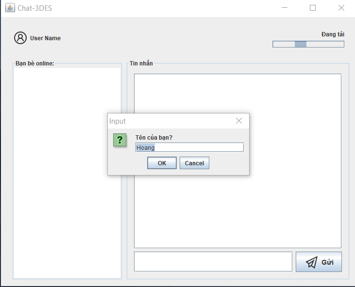
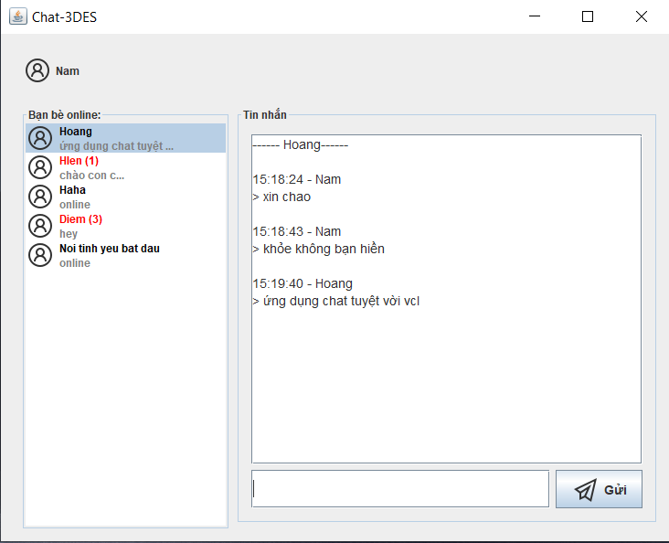

# Chat-3DES

- Ứng dụng chat online sử dụng **Socket** + **Java Swing**
- Triển khai **TripleDES** (tự code)
- Kết hợp mã hóa **RSA** (dùng thư viện)

## Setup

 1. Clone repo
 2. Chạy file `src/server/RunServer.java` (khuyên dùngNetBeans 8.2) để mở Server
 3. Chạy file `src/client/RunClient.java`để mở client
 4. Ô nhập tên hiện ra, nhập tên và OK để kết nối tới server

## Screenshot

+ Nhập tên:

+ Nhắn tin:

